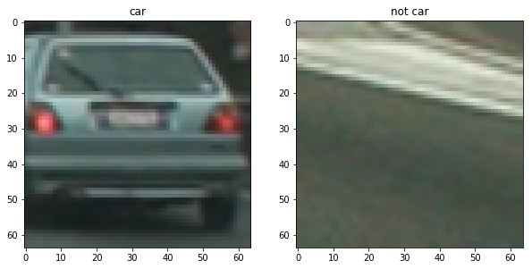
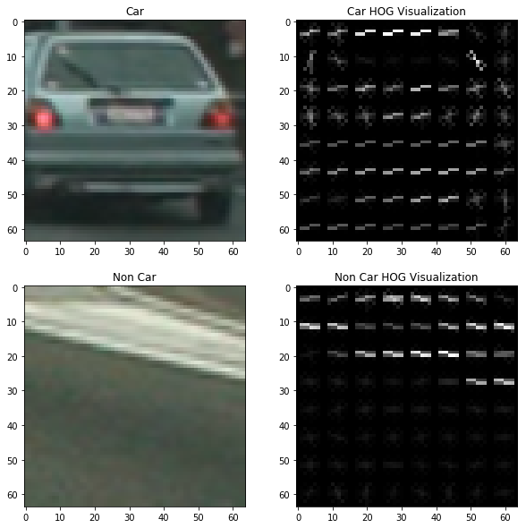
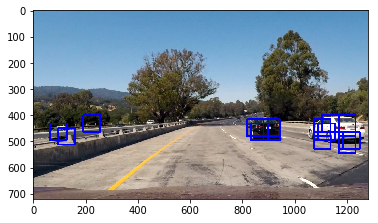
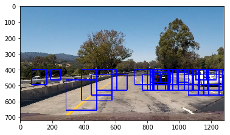
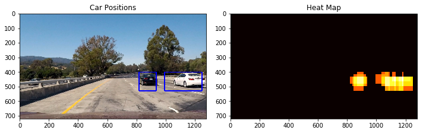

## Writeup 
---

**Vehicle Detection Project**

The goals / steps of this project are the following:

* Perform a Histogram of Oriented Gradients (HOG) feature extraction on a labeled training set of images and train a classifier Linear SVM classifier
* Optionally, you can also apply a color transform and append binned color features, as well as histograms of color, to your HOG feature vector. 
* Note: for those first two steps don't forget to normalize your features and randomize a selection for training and testing.
* Implement a sliding-window technique and use your trained classifier to search for vehicles in images.
* Run your pipeline on a video stream (start with the test_video.mp4 and later implement on full project_video.mp4) and create a heat map of recurring detections frame by frame to reject outliers and follow detected vehicles.
* Estimate a bounding box for vehicles detected.


## [Rubric](https://review.udacity.com/#!/rubrics/513/view) Points
### Here I will consider the rubric points individually and describe how I addressed each point in my implementation.  

---
### Writeup 

### Histogram of Oriented Gradients (HOG)

#### 1. Explain how (and identify where in your code) you extracted HOG features from the training images.

The code for this step is contained in the first code cell of the IPython notebook.  

I started by reading in all the `vehicle` and `non-vehicle` images.  Here is an example of one of each of the `vehicle` and `non-vehicle` classes:



I then explored different color spaces and different `skimage.hog()` parameters (`orientations`, `pixels_per_cell`, and `cells_per_block`). The extracting HOG features is implemented in the block `In[6]` in the file `project.ipynb`. I grabbed random images from each of the two classes and displayed them to get a feel for what the `skimage.hog()` output looks like.

Here is an example using the `HLS` color space and HOG parameters of `orientations=11`, `pixels_per_cell=(8, 8)` and `cells_per_block=(2, 2)`:




#### 2. Explain how you settled on your final choice of HOG parameters.

I tried various combinations of parameters. I first tried to extract the HOG features of `orientations =11 `, ,`pixels_per_cell=(8, 8)`, and `cells_per_block=(2, 2)`. But I than found that it spends too much time to extract the HOG features and the feature vecture becomes especially long. So I decided to use the parameter of `pixels_per_cell=(16, 16)`.

#### 3. Describe how (and identify where in your code) you trained a classifier using your selected HOG features (and color features if you used them).

I trained a linear SVM using the function from sklearn.svm library in block `In[8]`

```python

# Calculate vehicle center
svc = LinearSVC()
svc.fit(X_train, y_train)

```
In order to train the linear SVM, I did the following stuff.
I first split the features into two train and test sets with the functions `train_test_split`.  I then use the `StandardScaler` to normalized the data. After that, the SVM will be trained. At last, the accuracy is given by using `svc.score`.

I tried the various combination to get a higher accuracy. I found that, if the color features (bin spatial and hist features) is added, the accuracy is higher. But the vector of the features is bigger, and then the rate of false positive becomes also higher. So I decided to remove the color features.
  
### Sliding Window Search

#### 1. Describe how (and identify where in your code) you implemented a sliding window search.  How did you decide what scales to search and how much to overlap windows?

I first used the lesson functions `search_windows` to extract the feature of each window. It will first detect the type of color space, and then convert the image into desired color space. Then in each window, the HOG feature will be extracted. At last, the trained SVC is called to implement the prediction.



But It is not effective. Because in one region, the HOG feature could be extracted multiple times. Thus I used the `find_car` functions to just extract the features once. I then search the window positions at several scales as follows with the `cell_per_step = 1`.

``` python

    scales  = [1.0, 1.0, 1.5, 1.5, 2.0, 2.0, 3.0, 3.0]
    ystarts = [400, 416, 400, 432, 400, 432, 400, 464]
    ystops  = [464, 480, 496, 528, 528, 560, 596, 660] 

```
With this, the windwos near our vehicle is relative larger, and windwos far away the vehicle is smaller.   

#### 2. Show some examples of test images to demonstrate how your pipeline is working.  What did you do to optimize the performance of your classifier?

Ultimately I searched on two scales using HLS 3-channel HOG features. Here are some example images as follows.



There are still several false positives. So I have to use the heat map to reduce the false positives(see below).

---

### Video Implementation

#### 1. Provide a link to your final video output.  Your pipeline should perform reasonably well on the entire project video (somewhat wobbly or unstable bounding boxes are ok as long as you are identifying the vehicles most of the time with minimal false positives.)
Here's a [link to my video result](output_images/project_video_output.mp4)


#### 2. Describe how (and identify where in your code) you implemented some kind of filter for false positives and some method for combining overlapping bounding boxes.

I recorded the positions of positive detections in each frame of the video.  From the positive detections, I created a heatmap and then thresholded that map to identify vehicle positions.  I then used `scipy.ndimage.measurements.label()` to identify individual blobs in the heatmap.  I then assumed each blob corresponded to a vehicle.  I constructed bounding boxes to cover the area of each blob detected as follows.

``` Python
# Define a bounding box based on min/max x and y
bbox = ((np.min(nonzerox), np.min(nonzeroy)), (np.max(nonzerox), np.max(nonzeroy)))

```

Here's an example result showing the heatmap from a series of frames of video, the result of `scipy.ndimage.measurements.label()` and the bounding boxes:



---

### Discussion

#### 1. Briefly discuss any problems / issues you faced in your implementation of this project.  Where will your pipeline likely fail?  What could you do to make it more robust?

I found it is a little hard to balance the rate of detection and the rate of false positives. I first used the color features. It brings the higher classified accuracy with high false positive. Maybe it's overfitting. I think I can probably use the Decision tree first to reduce some unimportant color features.

I found the bounding box is not so stable, it shakes sometimes. And the choice of the threshold is also tricky. If it is too large, the bounding box can be split. If it is too small, the false positive cannot be fully eliminated.
